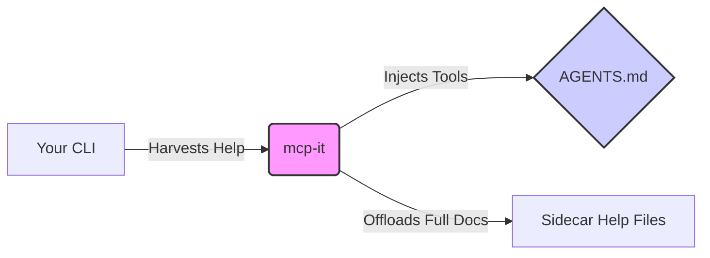

# mcp-it


[](https://opensource.org/licenses/MIT)


> **Inject your CLI tools directly into your Agent's brain.** 🧠 ⚡️

**mcp-it** is the missing link between your CLI tools and your Agentic workflows. It automatically harvests commands, options, and descriptions from any CLI and injects them as structured tools into your `AGENTS.md`, `CLAUDE.md`, or any other instruction file.

---

## 🚀 Why mcp-it?

*   **🔄 Always in Sync**: Stop manually copying help text. Keep your agent instructions perfectly synchronized with your actual CLI surface area.
*   **📦 Multi-CLI Support**: Manage tools for `gh`, `aws`, `kubectl`, and more in a single `AGENTS.md` without conflicts.
*   **📉 Token Efficient**: Automatically truncates massive help outputs and offloads full documentation to sidecar files, keeping your context window clean.
*   **🤖 Agent Native**: Designed specifically for the new wave of "Agentic" markdown instruction files.

## 🛠️ How it Works



1.  **Harvest**: `mcp-it` runs your CLI with `--help` (and variants) to understand its capabilities.
2.  **Process**: It parses the output, extracting commands and descriptions.
3.  **Inject**: It updates a specific section in your `AGENTS.md`, leaving the rest of your prompt engineering untouched.

## ⚡️ Quick Start

Get started in seconds with `uv`.

### 1. Install & Sync
```bash
uv sync
```

### 2. Inject Tools
Harvest `gh` (GitHub CLI) tools and inject them into `AGENTS.md`.
```bash
uv run mcp-it gh AGENTS.md --create-if-missing
```

### 3. Preview Changes
Want to see what will happen without writing to disk?
```bash
uv run mcp-it gh AGENTS.md --dry-run
```

## 📖 Usage Guide

### Basic Injection
```bash
uv run mcp-it <cli_command> <target_file> [options]
```

### Key Options

| Option | Description |
| :--- | :--- |
| `--create-if-missing` | Create the target file if it doesn't exist. |
| `--dry-run` | Print the updated content to stdout instead of writing to the file. |
| `--max-help-chars <n>` | Limit embedded help text to `n` characters (default: 1500). |
| `--help-output <path>` | Custom path for the full sidecar help file. |
| `--all` | Try `help --all` for CLIs that support it (better discovery). |
| `--workdir <path>` | Run the CLI and resolve paths from a specific directory. |

### Example: Force Truncation
Keep your `AGENTS.md` lightweight by forcing truncation at 1200 characters.
```bash
uv run mcp-it gh AGENTS.md --max-help-chars 1200
# Full help will be saved to AGENTS/tools/gh-help.txt
```

## 🧩 What gets injected?

`mcp-it` manages a block in your file delimited by special comments. **Do not remove these comments** if you want to enable future updates.

```markdown
<!-- mcp-it tools start -->
## External CLI tools for `gh`
...
### repo
Description: Manage repositories
Invocation: `gh repo ...`
...
<!-- mcp-it tools end -->
```

## 🤝 Contributing

We welcome contributions! Whether it's tidying up parsers for specific CLIs, adding tests, or extending help introspection.

1.  **Setup**: `uv sync`
2.  **Run Locally**: `uv run mcp-it --help`
3.  **Submit**: Open an issue or PR with reproduction steps or sample help outputs.

---

<p align="center">
  Made with ❤️ for the Agentic future.
</p>
